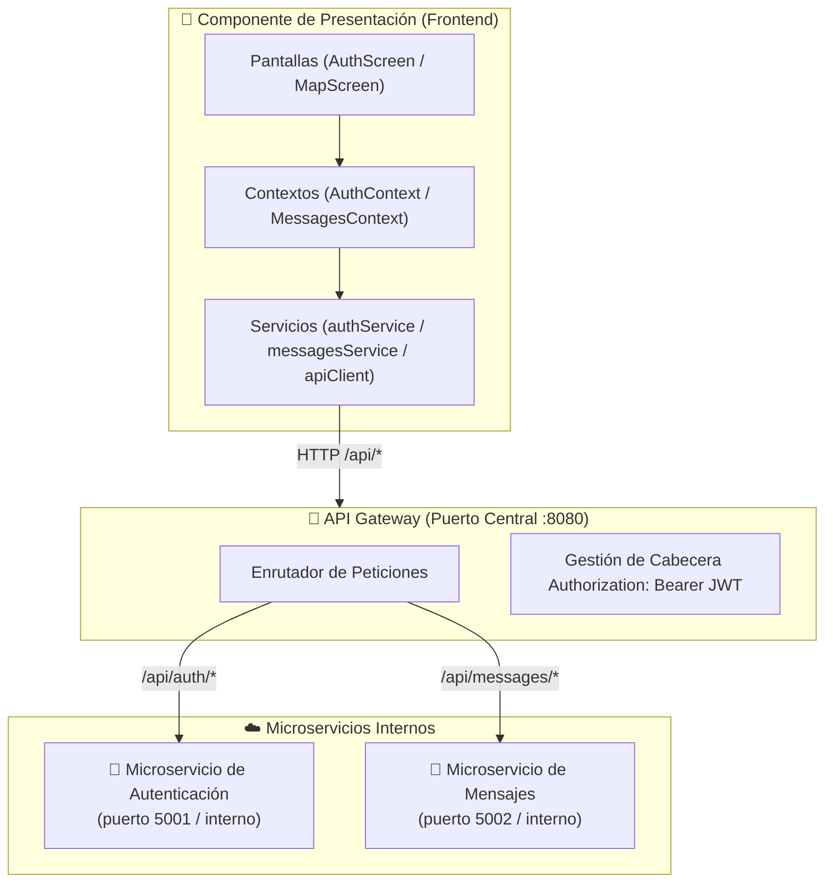
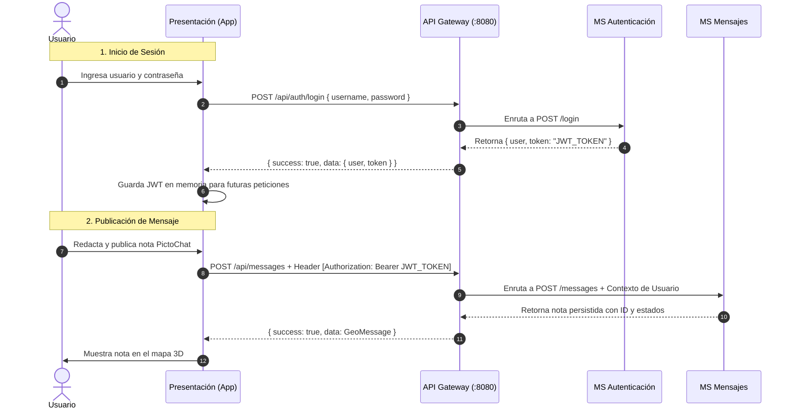

# 🌐 Guía de Integración con API Gateway y Microservicios

Este documento explica cómo funciona la arquitectura de **API Gateway** con los microservicios de **Autenticación** y **Mensajes**, y cómo está preparado este módulo de presentación (`GeoPicto`) para conectarse a ellos.

---

## 1. ¿Qué es un API Gateway y cómo funciona?

En una arquitectura de microservicios tradicional, cada servicio corre de manera independiente en su propio puerto, contenedor o servidor:
- **Microservicio de Autenticación**: Ej. `http://servidor:5001`
- **Microservicio de Mensajes Geoespaciales**: Ej. `http://servidor:5002`

### El Problema sin API Gateway:
Si la aplicación cliente (nuestra app móvil/web) tuviera que comunicarse directamente con cada microservicio:
1. Tendría que conocer las URLs y puertos de cada microservicio por separado.
2. Cada microservicio tendría que lidiar con políticas de CORS, certificados SSL y control de dominios.
3. Habría acoplamiento: si se divide o renombra un servicio interno, la app se rompería.

### La Solución: API Gateway (Punto Único de Entrada)
El **API Gateway** es un servidor intermediario (Reverse Proxy / Puerta de Enlace) que expone una **única URL pública** (por ejemplo `http://localhost:8080` o `https://api.geopicto.org`).

La aplicación cliente **solo se comunica con el API Gateway**, y este se encarga de:
- **Enrutamiento (Routing):** Redirige las peticiones según la ruta URL hacia el microservicio correspondiente.
- **Seguridad y Tokens (JWT):** Valida o propaga los tokens de sesión.
- **Unificación de CORS y SSL:** Centraliza el acceso para clientes web y móviles.
- **Balanceo y Resiliencia:** Distribuye carga y protege los servicios internos.

---

## 2. Diagrama de Arquitectura



---

## 3. Flujo de Comunicación y Seguridad (JWT)



---

## 4. Estructura del Módulo en el Proyecto

El proyecto cuenta con una capa de servicios modular y desacoplada ubicada en `src/services/` y `src/config/`:

| Archivo | Responsabilidad |
|---|---|
| [`src/config/api.config.ts`](file:///Users/diegomellizo/Documents/Semestre-2026-2/Arquisoft/presentacion/src/config/api.config.ts) | Define la URL base del Gateway, endpoints `/api/auth` y `/api/messages`, timeouts y el switch de modo Mock. |
| [`src/services/api/apiClient.ts`](file:///Users/diegomellizo/Documents/Semestre-2026-2/Arquisoft/presentacion/src/services/api/apiClient.ts) | Cliente HTTP con inyección automática de cabeceras `Authorization: Bearer <token>`, timeouts con `AbortController` y manejo de errores `ApiError`. |
| [`src/services/auth/authService.ts`](file:///Users/diegomellizo/Documents/Semestre-2026-2/Arquisoft/presentacion/src/services/auth/authService.ts) | Métodos `login()`, `register()`, `logout()` y `getProfile()`. Con soporte de fallback automático a simulación. |
| [`src/services/messages/messagesService.ts`](file:///Users/diegomellizo/Documents/Semestre-2026-2/Arquisoft/presentacion/src/services/messages/messagesService.ts) | Métodos `getMessages()`, `createMessage()` y `deleteMessage()`. Con soporte de fallback automático. |
| [`src/context/AuthContext.tsx`](file:///Users/diegomellizo/Documents/Semestre-2026-2/Arquisoft/presentacion/src/context/AuthContext.tsx) | Contexto de React que maneja el estado del usuario, carga asíncrona y errores. |
| [`src/context/MessagesContext.tsx`](file:///Users/diegomellizo/Documents/Semestre-2026-2/Arquisoft/presentacion/src/context/MessagesContext.tsx) | Contexto que orquesta los mensajes en el mapa, filtros y recarga en tiempo real. |

---

## 5. Contratos de API Esperados (Para el equipo de Backend)

Para cuando tus compañeros o tú configuren el API Gateway y los microservicios, estos son los contratos JSON esperados:

### A. Autenticación (`/api/auth/*`)

#### 1. Iniciar Sesión: `POST /api/auth/login`
- **Request Body:**
  ```json
  {
    "usernameOrEmail": "ExploradorGeo",
    "password": "miPasswordSeguro"
  }
  ```
- **Response 200 OK:**
  ```json
  {
    "success": true,
    "data": {
      "user": {
        "id": "usr-101",
        "username": "ExploradorGeo",
        "email": "explorador@geochat.org",
        "color": "#009CD8"
      },
      "token": "eyJhbGciOiJIUzI1NiIsInR5cCI6IkpXVCJ9..."
    }
  }
  ```

#### 2. Registro: `POST /api/auth/register`
- **Request Body:**
  ```json
  {
    "username": "NuevoUsuario",
    "email": "nuevo@geochat.org",
    "password": "miPasswordSeguro"
  }
  ```
- **Response 201 Created / 200 OK:**
  Misma estructura que el login con usuario y token generado.

---

### B. Mensajes Geoespaciales (`/api/messages/*`)

#### 1. Listar Mensajes: `GET /api/messages`
- **Query Params opcionales:** `?lat=4.6382&lng=-74.0841&radius=300&status=publicado`
- **Response 200 OK:**
  ```json
  {
    "success": true,
    "data": [
      {
        "id": "msg-1",
        "authorId": "usr-101",
        "authorName": "ExploradorGeo",
        "authorColor": "#009CD8",
        "content": "Reunión de estudio en la biblioteca central piso 3.",
        "latitude": 4.6382,
        "longitude": -74.0841,
        "createdAt": "2026-10-03T20:00:00.000Z",
        "expiresAt": "2026-10-04T20:00:00.000Z",
        "status": "publicado"
      }
    ]
  }
  ```

#### 2. Crear Mensaje: `POST /api/messages`
- **Headers:** `Authorization: Bearer <token>`
- **Request Body:**
  ```json
  {
    "content": "¡Hola a todos desde la Plaza Central!",
    "latitude": 4.6385,
    "longitude": -74.0839,
    "status": "publicado",
    "expirationHours": 24,
    "authorId": "usr-101",
    "authorName": "ExploradorGeo",
    "authorColor": "#009CD8"
  }
  ```
- **Response 201 Created:**
  ```json
  {
    "success": true,
    "data": {
      "id": "msg-nuevo-456",
      "content": "¡Hola a todos desde la Plaza Central!",
      "latitude": 4.6385,
      "longitude": -74.0839,
      "status": "publicado",
      "createdAt": "2026-10-03T21:00:00.000Z",
      "expiresAt": "2026-10-04T21:00:00.000Z",
      "authorId": "usr-101",
      "authorName": "ExploradorGeo",
      "authorColor": "#009CD8"
    }
  }
  ```

#### 3. Eliminar Mensaje: `DELETE /api/messages/:id`
- **Headers:** `Authorization: Bearer <token>`
- **Response 200 OK:**
  ```json
  {
    "success": true,
    "message": "Mensaje eliminado con éxito"
  }
  ```

---

## 6. ¿Cómo cambiar entre Modo Simulación (Mock) y API Gateway Real?

El proyecto está diseñado con **resiliencia total**:

### Opción 1: Variable de Entorno `.env`
Edita el archivo `.env`:
```bash
# Cambia la URL cuando tengas el API Gateway corriendo
EXPO_PUBLIC_API_GATEWAY_URL=http://localhost:8080

# 'true': Usa datos simulados (para seguir diseñando o probando sin backend)
# 'false': Se conecta al API Gateway real
EXPO_PUBLIC_USE_MOCK_DATA=false
```

### Opción 2: Fallback Automático
Si configuras `EXPO_PUBLIC_USE_MOCK_DATA=false` pero el Gateway aún no está encendido o se cae la red, la aplicación **no se cerrará ni mostrará pantalla en blanco**: activará el fallback automático usando los datos locales de prueba y registrará un aviso en la consola para facilitar la depuración.
